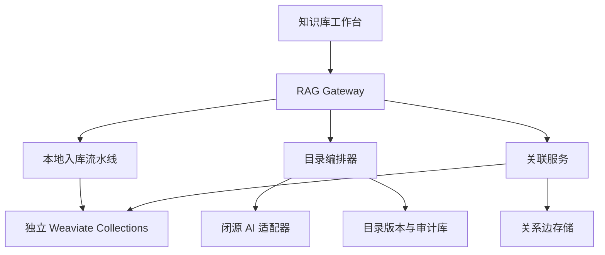
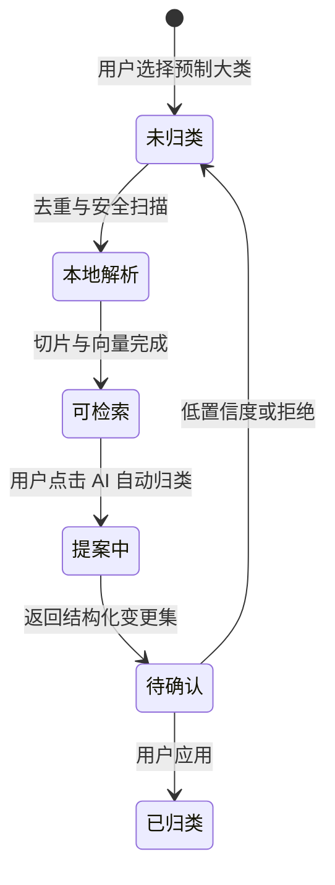

# 知识库分类、隔离与潜关联后端迭代方案

## 1. 已确认的产品决策

| 范围 | 采用方案 | 落地约束 |
| --- | --- | --- |
| 分类结构 | A：多级目录树 | 大类固定由用户手动选择；子树由 AI 提案式维护 |
| 数据隔离 | A：每库独立 | 独立 collection、权限、切片策略、保留策略和索引参数 |
| 管理界面 | A：工作台 + 详情抽屉 | 左侧库列表、中间树与队列、右侧详情和变更预审 |
| 新文件入口 | 预制大类 / 未归类 | 入库时不调用闭源 AI，不自动移动文件 |
| 自动归类 | 用户手动点击 | 只生成变更提案；预审并确认后才应用 |
| 跨库关系 | 独立关联知识库 | 只存关系边和证据指针，不复制其他库正文 |

## 2. 推荐后端边界



建议新增三个服务边界，但第一阶段仍可放在同一个 Gateway 进程中：

1. `ingestion-service`：解析、去重、切片、本地摘要、实体提取和向量化。
2. `taxonomy-orchestrator`：生成路由卡、裁剪相关子树、调用闭源 API、校验 JSON、生成可撤销变更集。
3. `association-service`：候选边发现、证据校验、图扩展和跨库推理上下文组装。

闭源 API Key 只存在于服务器环境变量或密钥管理器中，不下发浏览器。

## 3. A 方案的数据隔离

每个知识库必须有独立的物理或逻辑索引边界，不能只依赖一个 `scope` 字段过滤。

| 知识库 | 建议 collection | 默认特点 |
| --- | --- | --- |
| AI 工作记录 | `kb_ai_work_v1` | 会话、项目、模型、决策类型字段；时间衰减中等 |
| 学术资料 | `kb_academic_v1` | DOI、作者、年份、版本、引用；保留原页码 |
| 生产文档 | `kb_production_v1` | 环境、版本、责任人、有效期；新版本优先 |
| 个人思维笔记 | `kb_notes_v1` | 多标签、弱结构、时间衰减低、允许多归属 |
| 关联知识库 | `kb_association_v1` | 关系说明向量；不保存原文副本 |

每个库配置独立 ACL、Embedding 版本、切片、混合权重、时间衰减、备份策略和 schema version。

目录树不应直接等于磁盘目录。使用稳定 `node_id` 管理逻辑树；物理文件保持原位置或进入受控对象存储，避免目录调整触发大规模搬移和重新索引。

## 4. 新文件与人工大类流程



- 入库请求必须携带 `library_id` 和 `target_node_id=unclassified`。
- 未归类不等于不可检索。可先完成索引，但检索结果显示“未归类”状态。
- AI 不直接执行 `MOVE`、`CREATE_BRANCH` 或 `MERGE_BRANCH`。
- 每次应用生成新的 `taxonomy_version`，保留反向操作以便撤销。
- 同一文件允许“主目录 + 标签”；个人笔记可有多个逻辑引用，但只保留一份正文。

## 5. 节省 Token 的闭源 AI 归类方案

### 5.1 路由卡代替全文

本地服务先为每个新文件生成一张约 180–320 tokens 的 routing card：

```json
{
  "file_id": "doc_01J...",
  "title": "vLLM 双卡 OOM 排查",
  "mime": "text/markdown",
  "language": "zh-CN",
  "headings": ["症状", "显存参数", "验证结果"],
  "summary": "双 RTX 3090 上调整 tensor parallel、显存利用率和上下文长度的排障记录。",
  "entities": ["vLLM", "RTX 3090", "tensor-parallel-size"],
  "signals": ["troubleshooting", "deployment"],
  "content_hash": "sha256:..."
}
```

默认禁止上传正文、原始附件、完整代码、Embedding 向量和个人身份信息。若路由卡不足，只允许模型二次请求最多 2 个短片段，每段设置硬上限并记录审计。

### 5.2 只发送受影响子树

1. 本地向量先从目录节点描述中召回 8–12 个候选节点。
2. 取候选节点的父、同级和一级子节点，裁剪成 `affected_subtree`。
3. 最深默认 4 层，节点数默认不超过 60。
4. 向闭源模型发送目录版本哈希；同版本批次复用固定提示和分类准则缓存。
5. 批量处理 20–40 张路由卡，避免逐文件重复发送目录。

### 5.3 结构化短输出

远程模型只返回 JSON：

```json
{
  "taxonomy_version": 18,
  "operations": [
    {
      "op": "move",
      "file_id": "doc_01J...",
      "target_node_id": "pr_incidents_gpu_oom",
      "confidence": 0.96,
      "reason_code": "TITLE_ENTITY_AND_TASK_MATCH"
    }
  ],
  "holds": [
    {
      "file_id": "doc_01K...",
      "confidence": 0.54,
      "reason_code": "AMBIGUOUS_SIBLINGS"
    }
  ]
}
```

- `>= 0.88`：可勾选批量应用，但仍需用户确认；
- `0.65–0.88`：进入逐项复核；
- `< 0.65`：保留未归类。只有文件内容或目录版本变化后才重试。

### 5.4 单批预算

| 项目 | 建议上限 |
| --- | ---: |
| 固定指令与 JSON Schema | 800 tokens |
| 受影响子树 | 900 tokens |
| 20 张路由卡 | 5,000 tokens |
| JSON 输出 | 1,200 tokens |
| 总硬上限 | 8,000 tokens |

进一步通过提示缓存、目录版本哈希、增量路由卡、按候选子树分组和文件哈希去重降低消耗。

## 6. 目录版本与审计

推荐 PostgreSQL；单机第一阶段可用 SQLite，字段保持可迁移：

```sql
CREATE TABLE taxonomy_node (
  node_id TEXT PRIMARY KEY,
  library_id TEXT NOT NULL,
  parent_node_id TEXT,
  name TEXT NOT NULL,
  description TEXT,
  status TEXT NOT NULL DEFAULT 'active',
  version_created INTEGER NOT NULL,
  version_retired INTEGER
);

CREATE TABLE taxonomy_change_set (
  change_set_id TEXT PRIMARY KEY,
  library_id TEXT NOT NULL,
  base_version INTEGER NOT NULL,
  status TEXT NOT NULL,
  requested_by TEXT NOT NULL,
  model_provider TEXT,
  model_name TEXT,
  prompt_tokens INTEGER,
  completion_tokens INTEGER,
  operations_json JSON NOT NULL,
  created_at TIMESTAMP NOT NULL,
  applied_at TIMESTAMP
);
```

应用变更使用乐观锁。若 `expected_taxonomy_version` 与当前版本不一致，返回 `409 taxonomy_version_conflict`，要求重新生成预览。

## 7. 关联知识库

### 7.1 关系边，而不是全文副本

```sql
CREATE TABLE knowledge_edge (
  edge_id TEXT PRIMARY KEY,
  source_library_id TEXT NOT NULL,
  source_document_id TEXT NOT NULL,
  target_library_id TEXT NOT NULL,
  target_document_id TEXT NOT NULL,
  relation_type TEXT NOT NULL,
  confidence REAL NOT NULL,
  evidence_chunk_ids JSON NOT NULL,
  rationale_id TEXT,
  status TEXT NOT NULL DEFAULT 'candidate',
  created_by TEXT NOT NULL,
  valid_from TIMESTAMP,
  valid_to TIMESTAMP
);
```

第一版关系类型：`supports`、`contradicts`、`conditional_on`、`analogous_to`、`derived_from`、`co_occurs_with`。

PostgreSQL / SQLite 负责确定性边和审计；`kb_association_v1` 只保存关系解释的短文本向量。初期不必引入专用图数据库。

### 7.2 低成本候选边发现

1. 新文档本地提取实体、主题、时间和主张指纹。
2. 先用向量与关键词从其他库召回候选文档，不调用大模型。
3. 只把候选双方的 routing card 和各 1–2 条证据片段交给闭源模型判定关系。
4. `candidate` 边进入人工复核；确认后才用于默认检索扩展。
5. 文件更新或过期时，相关边进入 `stale`，不删除审计记录。

### 7.3 反直觉结论约束

- 默认只扩展 1 跳；“探索模式”才允许 2 跳；
- 每次最多 12 条边、每个来源库最多 4 条；
- 先图过滤再取证据片段，最后才调用语言模型；
- 反直觉结果至少需要两个独立知识库的证据；
- 冲突证据与支持证据必须同时呈现；
- 输出标记为“假设”“推断”或“已验证结论”；
- 每条结论返回原始文档和 chunk 引用。

## 8. API 草案

| 方法 | 路径 | 用途 |
| --- | --- | --- |
| `POST` | `/v1/libraries` | 创建隔离知识库 |
| `GET` | `/v1/libraries/:id/tree` | 获取指定版本目录树 |
| `POST` | `/v1/ingest/path` | 指定大类并进入未归类队列 |
| `POST` | `/v1/taxonomy/proposals` | 生成归类 / 分支提案，不写入 |
| `GET` | `/v1/taxonomy/proposals/:id` | 获取提案、Token 与隐私审计 |
| `POST` | `/v1/taxonomy/proposals/:id/apply` | 以版本锁应用勾选操作 |
| `POST` | `/v1/taxonomy/versions/:id/rollback` | 撤销到指定版本 |
| `POST` | `/v1/associations/discover` | 生成候选跨库边 |
| `POST` | `/v1/associations/:id/review` | 接受、拒绝或修改关系 |
| `POST` | `/v1/retrieve` | 支持 `association_mode=off|one_hop|explore` |

## 9. 安全与隐私默认值

- 闭源 AI 默认只收 routing card；全文上传需要每库单独显式开启。
- 本地先做密钥、身份证件、邮箱、电话号码和自定义实体遮盖。
- 每库配置允许的远程供应商和数据驻留区域。
- 记录模型、提示版本、输入文件 ID、Token、校验结果和应用人。
- 远程输出按不可信输入处理：JSON Schema 校验、节点 ID 白名单、操作数量上限。
- 禁止远程模型返回磁盘路径、SQL、任意 URL 或执行指令。
- 生产文档的过期版本默认不能创建新的“支持”关系。

## 10. 分阶段实施

### Phase 1：目录与隔离

- 建立 5 个 collection 和 library registry；
- 迁移现有文档到预制大类；
- 上线未归类队列、多级树读取、目录版本和审计；
- 接通当前工作台 UI。

### Phase 2：AI 提案式归类

- 本地 routing card；
- 闭源 AI adapter、JSON Schema 和 Token 预算；
- 变更预审、部分应用、撤销；
- 低置信度复核队列。

### Phase 3：关联知识库

- 实体与主张指纹；
- 候选边发现、人工复核和边失效；
- 一跳扩展检索与双库证据约束；
- “探索模式”反直觉假设输出。

### Phase 4：评测与治理

- 建立人工金标分类集；
- 监控移动准确率、低置信度率、每文档 Token 和撤销率；
- 只有在连续评测达标后，才考虑对极高置信度变更提供可选自动应用。
