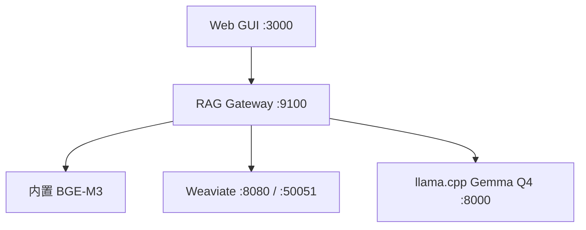

# 下一版本源码更新目标：Gemma × 全局 RAG

## 1. 已确认的运行事实

- 生成模型：Gemma 4 31B Q4 GGUF，由 `llama.cpp server` 提供 OpenAI 兼容接口。
- 当前启动入口：源码内 `scripts\gemma\manage-gemma.ps1`；不依赖固定 Windows 路径。
- 当前 Gemma 端口：`8000`。原方案中的 `8010` 保留为未来 Q4/Q8 并行部署规划，不作为当前默认值。
- 向量模型：`BAAI/bge-m3`，由 RAG Gateway 进程内加载；不使用 Ollama，也不再配置 `11434`。
- RAG Gateway：`127.0.0.1:9100`。
- Weaviate：HTTP `8080`、gRPC `50051`、监控 `2112`。
- Web GUI：`127.0.0.1:3000`。

## 2. 目标拓扑

浏览器最终只调用 Gateway。Weaviate 密钥、Gemma API 密钥、分类提示词、Token 预算和审计信息均留在后端。当前 GUI 仍保留直连 Gemma 的兼容回答路径；在 Gateway 的 `/v1/qa` 与 `/v1/qa/stream` 完成后删除该兼容路径。

## 3. 下一版本接口工作

1. 新增轻量问题分类器：输出固定 JSON，只允许 `lookup`、`explain`、`compare`、`troubleshoot`、`explore` 等白名单类别。
2. 分类器同时给出检索模式、建议 `alpha`、子问题（最多 3 个）和允许访问的知识库集合；服务端再次做权限交集。
3. BGE-M3 生成查询向量，Weaviate 执行 dense + BM25 混合召回。
4. 可选 BGE reranker 将候选压缩到 6–10 条证据；Gemma 不承担 Embedding 或 rerank。
5. Gateway 进行 Token 预算、证据编号和上下文拼装，再调用 Gemma。
6. 提供同步 `/v1/qa` 与流式 `/v1/qa/stream`；SSE 必须支持分块缓冲、心跳、取消和规范错误事件。
7. 回答必须带证据编号；找不到可靠证据时明确降级，不让模型补造事实。

详细协议、评测和分阶段上线步骤见 `docs/Gemma4-31B-Vector-RAG-Implementation-Plan-CN.md`。

## 4. 端口迁移原则

| 组件 | 当前默认 | 未来规划 | 配置来源 |
| --- | ---: | ---: | --- |
| GUI | 3000 | 3000 | `PORT` |
| Gateway | 9100 | 9100 | `--port` / `RAG_GATEWAY_PORT` |
| Weaviate HTTP | 8080 | 8080 | Compose |
| Weaviate gRPC | 50051 | 50051 | Compose |
| Gemma Q4 | 8000 | 8010（可选） | `GEMMA_PORT` |
| Gemma Q8 | 8002（按需） | 8011（规划） | `LLAMA_Q8_PORT` |
| Reranker | 未启用 | 8012 | 独立服务配置 |

代码、启动脚本和文档不得再次硬编码两个不同的 Gemma 端口。若迁移到 `8010`，应一次性修改服务配置并执行端到端健康检查。

## 5. 启动资料与缺口

源码已保存用户提供的全部参考启停脚本，并新增经过修正的正式管理器：

- `scripts/gemma/reference/start_q4_server_persistent_v4.bat`：实际 Q4 服务启动器。
- `scripts/gemma/reference/start_llama_chat_persistent_v3.bat`：交互式客户端启动器，不是服务器。
- `scripts/gemma/manage-gemma.ps1` + `llama-service.sh`：正式自包含启停入口。

正式管理器已包含 Q4/Q8 的实际 llama.cpp 参数，并使用带命令行身份验证的 PID 文件，避免原脚本按名称或端口误杀。制作可复现离线安装包时仍应保存 llama.cpp build commit、模型 SHA-256、chat template、`/props` 与 `/slots` 快照。

## 6. 验收标准

- 一键重启后 `3000/8000/8080/50051/9100` 全部就绪；`2112` 可选检查。
- 前端生产构建全部 JS/CSS chunk 返回 200。
- Gateway 检索继续使用 BGE-M3，旧 Ollama 地址不再出现在设置项。
- 问题分类输出通过 JSON Schema 校验，越权知识库 ID 被服务端剔除。
- `/v1/qa` 和 `/v1/qa/stream` 各完成至少 50 次测试，无 SSE 丢块、无 slot 泄漏。
- 日志不记录 API Key、完整私密文档或未脱敏提示词。
